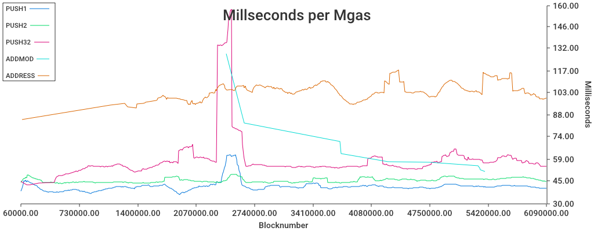
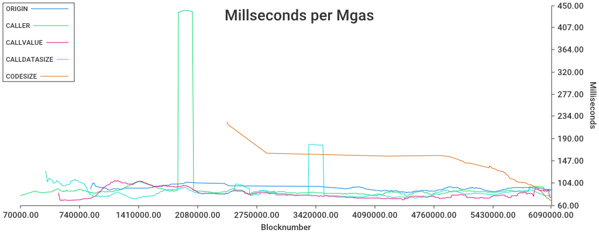
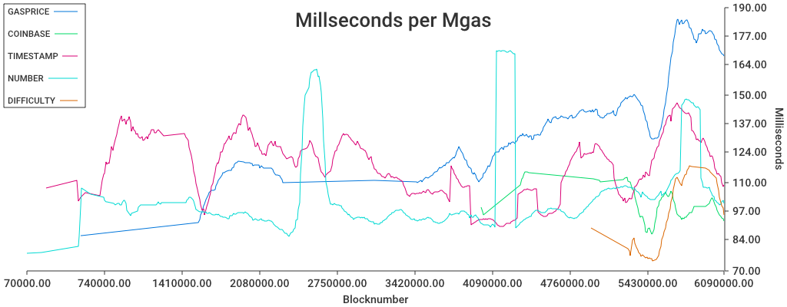
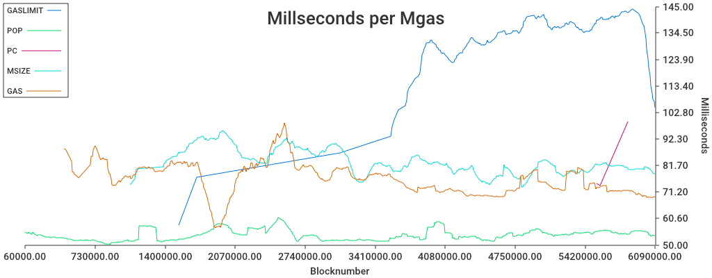
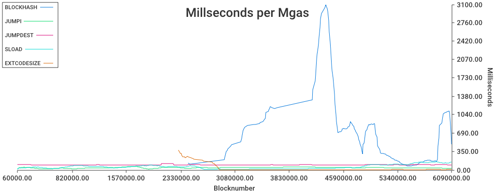

This repo is a collection of vm statistics, 
gathered from a geth instance. 

Examples from a `m5.2xlargge` aws instance that did a full-sync. 

### Time spent

The large thing there is `SLOAD`. 

## Cost of ops

Are operations well-balanced, gas-wise. 
Let's see

