This repo is a collection of vm statistics, 
gathered from a geth instance. 

Every data point represents `10k` blocks. Every time an opcode executed, a timer was stopped, the time since start was noted, and
the new opcode timer was started. After `10K` blocks, the data was dumped into a `json` file. The files are available in the `/m5.2xlarge/`-folder. 

The benchmarks are from a `m5.2xlarge` aws instance that did a full-sync. 
Such a machine has 

- `8 vcpu`, 
- `32 Gb RAM`
- `300 GB NVMe SSD`. 

### Time spent

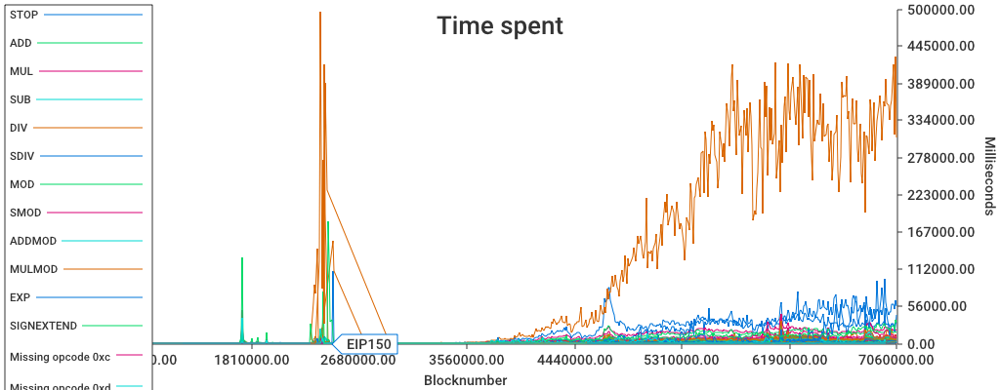

The large thing there is `SLOAD`. 

If we place a cap on it, and filter so we only see the top four things that take up the execution  time, we can see that the top ones are

- `SLOAD`, obviously, 
- `SSTORE` - hardly surprising. Even though `SSTORE` is expensive, it's also one that touches disk.
- `EXP` 
- `JUMPI` - This is a _very_ common opcode. Also, Geth nowadays defer the jump analysis until it's actually needed - the first time a `JUMP`/`JUMPI` is called. 

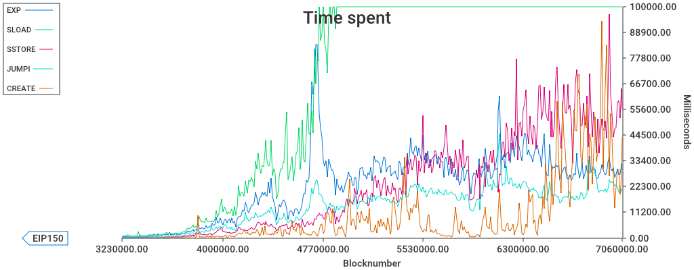

It seems that aside from `SLOAD`, there's no other single operation that dominates the remaining time that 
is spent on block processing. 

#### Time Pies!

Let's see how the time spent has progressed through time. 

The `2-3M` range contains the shanghai attacks. 

In the `3M-4M` range, we start seeing `SLOAD` take a larger piece of the pie. 

... and accounting for ~`50%` between `5M` and `6M`. 

## Count Pies!

We can also look at the _prevalence_ of opcodes -- that is, how _common_ is an opcode, and how has that varied over time? 

## Cost of ops

Are operations well-balanced, gas-wise?

### Arithmetic ops (`0x00`-range)

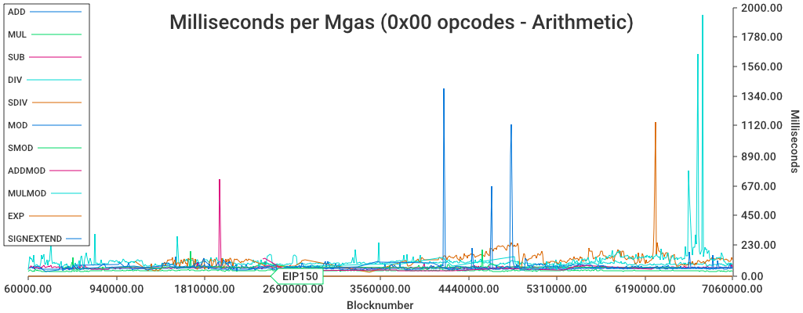

The arithmetic ops seems to vary within one order of magnitude -- some peaks which is likely due to noisy data. 
Here's a graph where it's been capped at `250`

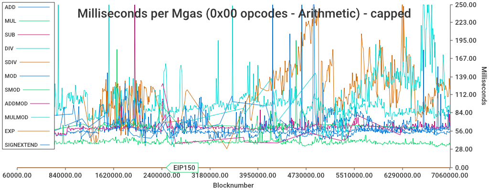

### Comparison ops (`0x10`-range)

The comparisons ops (also capped at `250`) are fairly aligned within `35` and `130`. The `NOT` looks pretty over-represented. 

### SHA3 ops (`0x20`-range)

The `SHA3` operation has it's own range. Since it'a dynamically priced operation, the gas has not been part of the data collection.
What we can do, however, is plot the time spent during `SHA3`, and the number of invocations.

The two line up pretty well, so the op doesn't 'degrade' over time. As expected.

## Context ops (`0x30`-range)

The following ops have dynamic gas, and are not charted:

	CALLDATALOAD,
	CALLDATACOPY,
	CODECOPY,
	EXTCODECOPY,
	RETURNDATACOPY,

Here are the remainders (split up into two charts, both capped at `500`): 
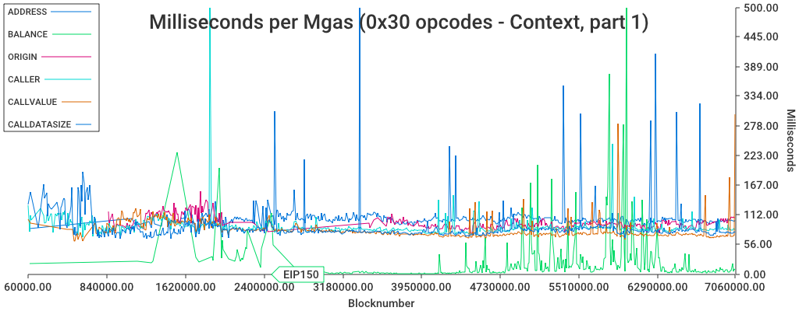
The big spike around `2.08M` is, surprisingly, `CALLER`. Aside from a few spikes, they're fairly well aligned -- except for `BALANCE`, which is starting to 
fluctuate and reaching high peaks. It was repriced in `EIP150`, anad was low for a few million blocks. 

Note: `BALANCE` should really be called `EXTBALANCE`, since it fetches balance for (potentially) external accounts. 

The `EXTCODESIZE` looks _extremely_ cheap -- which makes sense, since it was repriced at 
block `2463000` from `20` to `700`.

The Tangerine Whistle HF also contained these changes:

- Increase the gas cost of `EXTCODESIZE` to `700` (from `20`).
- Increase the base gas cost of `EXTCODECOPY` to `700` (from `20`).
- Increase the gas cost of `BALANCE` to `400` (from `20`).
- Increase the gas cost of `SLOAD` to `200` (from `50`).
- Increase the gas cost of `CALL`, `DELEGATECALL`, `CALLCODE` to `700` (from `40`).
- Increase the gas cost of `SELFDESTRUCT` to 5000 (from `0`).

##  Block operations (`0x40` range)

This chart capped at `600`. 

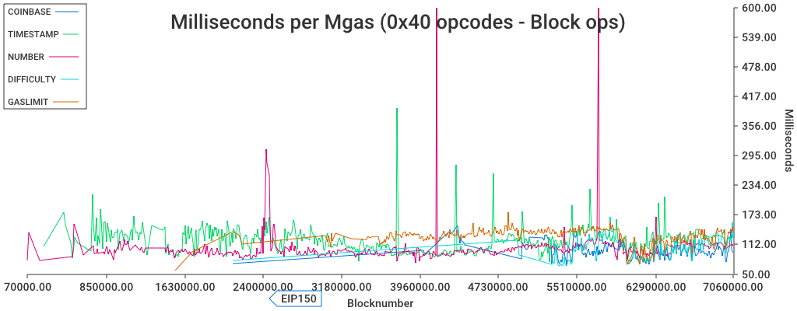

Missing from this chart is `BLOCKHASH`, which deserves it's own chart. It's plotted along with it's opcode count -- 
this operation is a bit quirky, and is more expensive when it's executed in isolation. So the more this op is used, the
cheaper the operations become (to a degree). 
This chart capped at `3000`. 

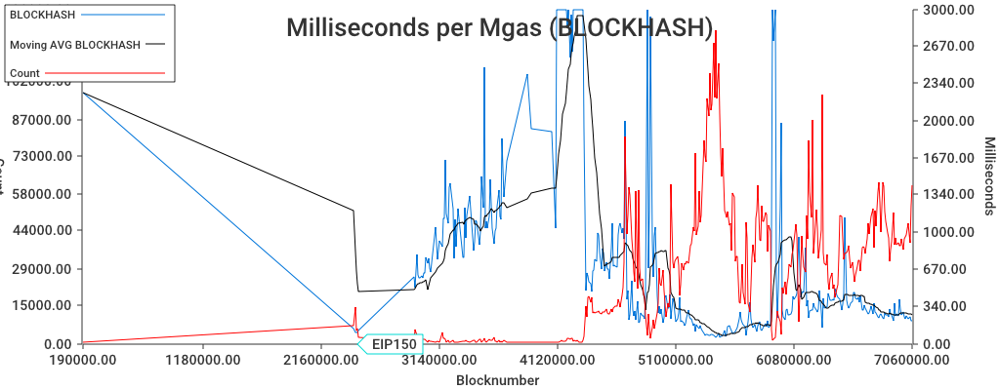

There are some further optimizations that can be done on this op, at least for geth. 

## Storage and execution (`0x50` range)

These are the ops

	POP
	MLOAD
	MSTORE
	MSTORE8
	SLOAD
	SSTORE
	JUMP
	JUMPI
	PC
	MSIZE
	GAS
	JUMPDEST

However, 

-`MSTORE` and `MSTORE8` have an additional cost for expanding memory
- `SLOAD` varies depending on previous value
- `JUMP`/`JUMPI` have a hidden cost: they require jumpdest analysis.

So the first graph here shows `POP`, `MLOAD`, `SLOAD`,`PC`, `MSIZE` and `GAS`, 
	
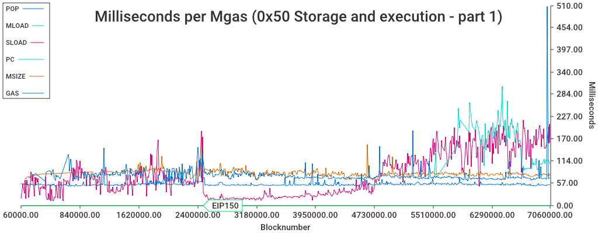

It's clear that `SLOAD` went down at `EIP150`, but has started to rise significantly since then. At around `5M`, it was back 
to the same levels as before `EIP150`. 

## `0x60` range

These are `DUPX`,`SWAPX` and `PUSHX`. Here capped for spikes, at `600`:

Here capped at `100`:

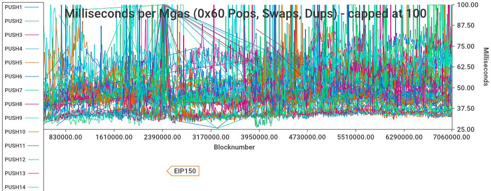

## `0xa0` - Logging

The `LOG` opcodes are dynamically priced, depending on the memory size, so we don't have gas/time charts, but here's a 
time spent-chart:

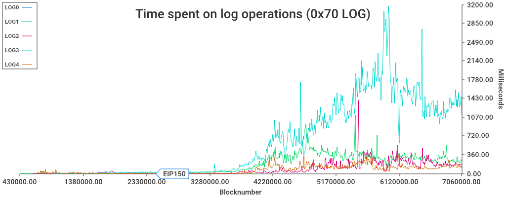

## `0xf0` - calling

Remaining ops are 'special' - both dynamic costs and non-trivial effects, such as starting new call contexts
or exiting from call contexts. 

	CREATE
	CALL
	CALLCODE
	RETURN
	DELEGATECALL
	CREATE2
	STATICCALL
	REVERT
	SELFDESTRUCT

# Some individual OPS

## SLOAD

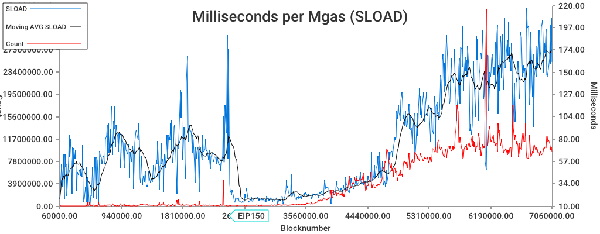

## BALANCE

